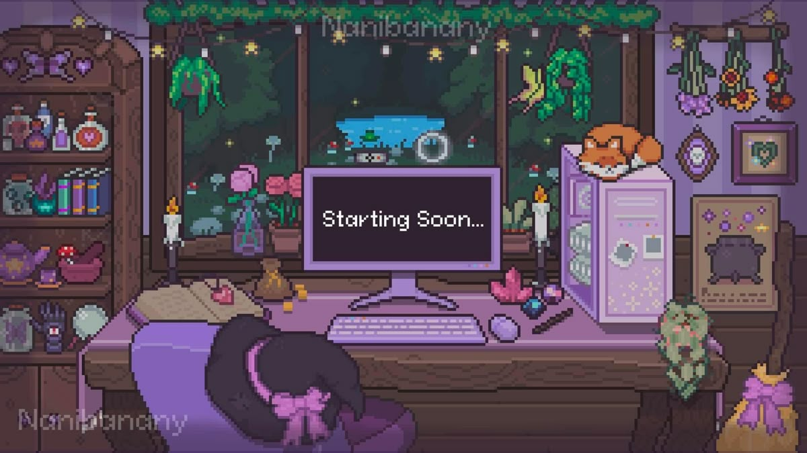

  

## 👋 Hi there, I'm Petra! 

<h3 align="center"> Working on projects pretty much every year, say hi 🤗 </h3>

- 🔭 I’m currently working on final these (theme: Analysis of Usability and Accessibility of User Interface Elements)
- 🌱 Currently learning PHP
- 💬 Brainstorming ideas
- 💡 Turning ideas into reality
- 🎯 Software Developer, Quality Engineer and Data Analyst
- 👨‍💻 Open to Full Stack or BA/QA jobs
- 📫 petra.jakopovi@gmail.com
- ⚡ Fun fact: I'm a deaf person with million hobbies
- 📷 Enthusiast in digital image and video editing, focusing on aesthetics and adding visual effects.

---

## 💻 Tech Stack:
<h3> Software Development Languages and Tools </h3>

  
  
  
  

  
  
 <!--  
  
  
  
  
  
  
  
  
   -->

<h3> Data Analysis and Visualisation </h3>

    
  
  

<h3> Video and Photo Editing </h3>

  

<!--  -->

---

## ⚡ Featured Software & Data Projects
- Music Catalog - Private project for study, currently in progress.
- [Odaks-app](https://github.com/PetriciaLee/odaks-app) - Private project for LUMEN Development hackathon 2025.
- [KingICT Ljetna akademija](https://github.com/PetriciaLee/KingICT.Academy2023) - Private project for Summer academy 2023. King ICT (Internship).
---

## 🚀 Goals for 2025
✅ Build scalable full-stack applications with React, Vue, Node.js  
✅ Expand expertise in DevOps & CI/CD pipelines  
✅ Explore AI & ML integration in software development 

---

## 📬 Let's Connect:

     🔗 Connect with me on LinkedIn!
    
  💼 Gmail: petra.jakopovi@gmail.com

---

